# Design brief for a scholarly Latin-companion Arabic typeface

There are a few Latin typefaces that have extended characters sets,
and good diacritic support
to
cover the needs of scholarly works.
For example [Brill](https://www.tiro.com/fonts/brill), and [Charis](https://software.sil.org/charis/).

What is needed is a good Arabic typeface that is a companion to these Latin typefaces.
I list here some properties that would be nice to have.
Many of these are in the spirit of the earliest Hijazi Arabic scripts,
and which I feel make them happily suitable for the difficult requirements of complete diacritic support.
Essentially this would be a "simplified" Arabic typeface.

## Requirements

### Visually similar to its Latin companion

Perhaps re-use i's dot in Arabic typeface?

Have similar stroke-widths?

### No extra leading needed for similar readability

This, I imagine, would be a very difficult requirement to meet.
But it would be very nice to have for inline Arabic within Latin text.

Perhaps have bigger counters (aka loop/eye) and smaller descenders.
Perhaps get inspiration from Fresco Arabic:

  
^[Fresco Arabic Characteristics - Diagram showing the characteristics of Fresco Arabic in relation to its Latin counterpart. Lara Assouad](https://www.khtt.net/en/page/587/fresco-arabic-western-latin-meets-western-kufi)

Fedra Arabic also matches Latin vs Arabic leading while going for same readability:
<https://tptq-arabic.com/fonts/fedra_serif_arabic>

Also get inspiration from some design choices of Mubassat and Maqroo typefaces?

### Complete diacritic support

Should ideally be able to render Hafs Quranic text.

Perhaps target all glyphs that Kitab font supports.

### Support for in-line and above letter diacritics

Some diacritics can be positioned above or after a basic consonontal character,
depending on the writing style and the intended sounding out.
Examples are dagger alef and hamza.

Here is dagger alif above a consonant:

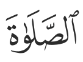

And here it is after a consonant:

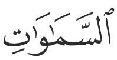

Hamza similarly can be above or after a consonant.
The issue is discussed in detail here:

<https://github.com/adamiturabi/arabic-inline-unicode/blob/main/index.pdf>

Perhaps allow for both CGJ and Tatweel based positioning in order to render existing encoded Quranic text correctly.
Perhaps re-use code from Kitab font.

### Diacritics have good readability

This again is a tricky one.
Diacritcs should be large and spaced out enough to be readable.
Yet, ideally they should not require extra leading.
And ideally not add noise to basic consonontal letters.

Perhaps:

+ Make them grayscale?
+ make alif and intial/medial lam shorter when they have a diacritic?

### All letter forms share the same basic glyph as much as possible.

Simple.

Makes it easier to avoid diacritic clashes.

### Only one ligature

Only one lam-alef ligature: لا

Same lam-alef ligature used for isolated and final form:

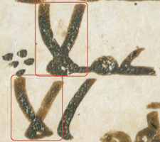

Should have enough space between lam and alef for an inline hamza.

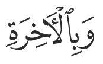

### No Kerning

Makes it easier to avoid diacritic clashes.

May need care so that waw and raa are not too far visually from next character.

### Standalone hamzah matches diacritic hamzah in size

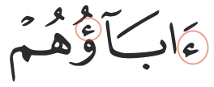

### A strong preference for horizontal joining

Ties in with only one (lam-alef) ligature.
Except:

### jeem is pseudo-vertically connected

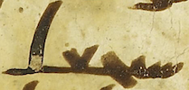
سيجعل

This doesn't necessarily have any practical benefit.

This is more of a personal preference for the typeface to match earliest Hijazi Arabic scripts.

### The character س's teeth are distinct from ب

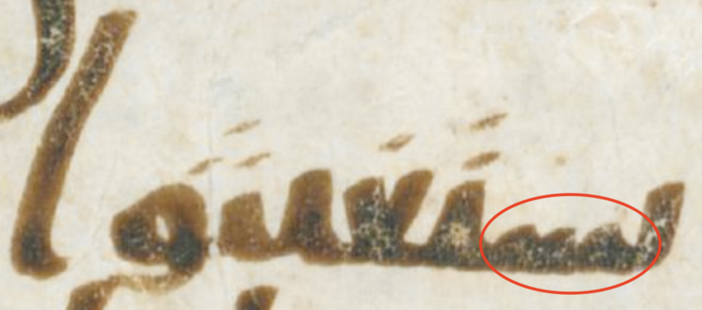

يستغيثوا

### All letter forms of ه are visually similar

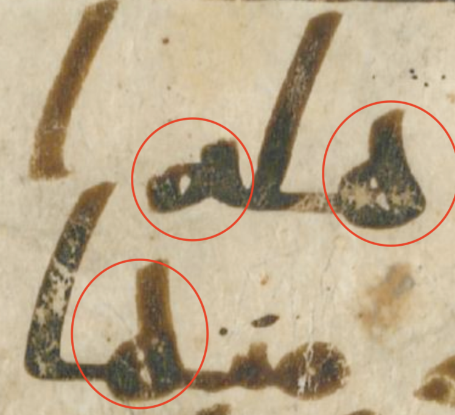

### Disregarding naskh final kaf

There is a mis-conception that Arabic's final/isolated kaf should be ك and that ک is Persian.
The former is only a design choice for naskh and similar scripts.

But ک is simpler and more consistent with initial and medial forms.

### Dal and kaf should share the same basic glyph

Again goes back to earliest scripts and avoid modern tendency of dal and jeem having a very similar shape.

Perhaps get some inspiration from
Fresco Arabic's kaf. Drop most of the arm (ذراع) for dal.

Optionally, medial kaf and dal would be identical (like the earliest scripts).
But this could be a user choice.

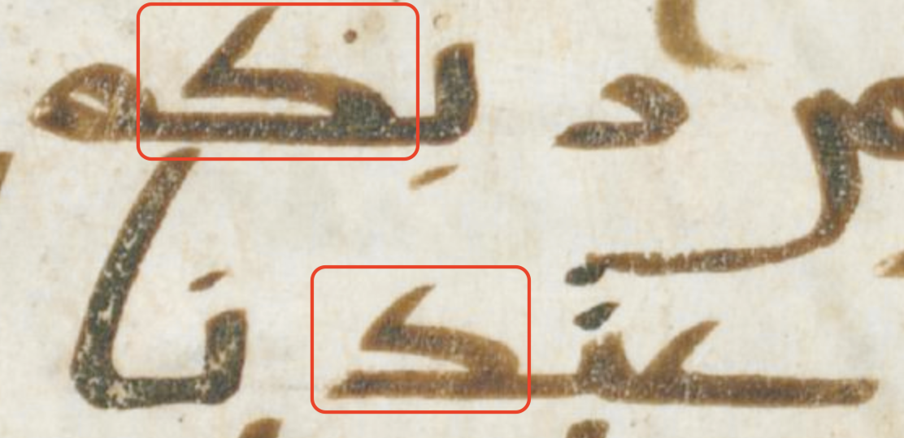

### Decide whether final-yeh should have initial bump or not

In Naskh the inital bump of final yeh is the previous character.
For example:

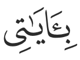

In the proposed font, if final yeh is to have an initial bump, it would not be the previous character.

Or drop the initial bump altogether.

### alif would have a "serif" at the bottom

alif would have a "serif" at the bottom (only) to distinguish it from Latin lower case l.

This matches Hijazi script.

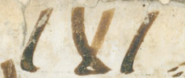

### Meem should be distinguished from fa/qaf

Again a personal preference.
Perhaps meem's eye should be split by the horizontal joiner,
whereas fa/qaf's is above.

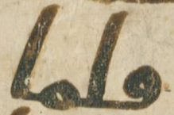

